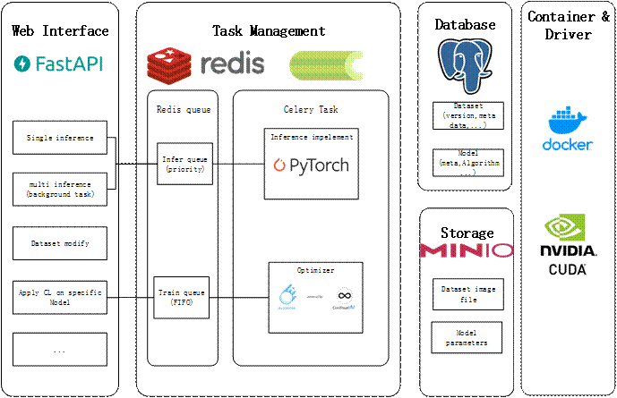

# CL_for_ImageSegmentation
early repo for applying Continual Learning on Image Segmentation task

## Introduction

Three scenarios of **Continual Learning**

- **Task-incremental learning:** Sequentially learn to solve a number of distinct tasks
- **Domain-incremental learning:** Learn to solve the same problem in different contexts
- **Class-incremental learning**: Discriminate between incrementally observed classes

Our specific task is obviously not beyond the field of **Domain-incremental learning**

## Experiments (TODO)

### SW engineering

### CL Learning Strategies Evaluation

Evaluation will be based on U-Net and  [Avalanche](https://github.com/ContinualAI/avalanche). **Waiting for specific model and data.**

#### Batch Domain Continual Learning

- Less-Forgetful Learning (LFL):  [paper](https://arxiv.org/pdf/1607.00122.pdf) | [pdf](./reference/1607.00122.pdf)
  - Less-forgetting Learning in Deep Neural Networks
  - `Jung H, Ju J, Jung M, et al. Less-forgetting learning in deep neural networks[J]. arXiv preprint arXiv:1607.00122, 2016.`

- Synaptic Intelligence (SI): [paper](http://proceedings.mlr.press/v70/zenke17a.html) | [pdf](./reference/ContinualLearningThroughSynapticIntelligence.pdf)
  - Continual Learning Through Synaptic Intelligence
  - `Zenke F, Poole B, Ganguli S. Continual learning through synaptic intelligence[C]//International conference on machine learning. PMLR, 2017: 3987-3995.`
- Elastic Weight Consolidation (EWC): [paper](https://www.pnas.org/content/114/13/3521) | [pdf](./reference/kirkpatrick-et-al-2017-overcoming-catastrophic-forgetting-in-neural-networks.pdf)
  - Overcoming catastrophic forgetting in neural networks
  - `Kirkpatrick J, Pascanu R, Rabinowitz N, et al. Overcoming catastrophic forgetting in neural networks[J]. Proceedings of the national academy of sciences, 2017, 114(13): 3521-3526.`

#### Online Domain Continual Learning

- Gradient Episodic Memory (GEM): [paper](https://proceedings.neurips.cc/paper/2017/hash/f87522788a2be2d171666752f97ddebb-Abstract.html) | [pdf](./reference/NIPS-2017-gradient-episodic-memory-for-continual-learning-Paper.pdf)
  - Gradient Episodic Memory for Continual Learning
  - `Lopez-Paz D, Ranzato M A. Gradient episodic memory for continual learning[J]. Advances in neural information processing systems, 2017, 30.`

#### Others

- Replay Buffer
- Selection strategies
- Loss Functions
- ...

- Multi-Domain Incremental Learning for Semantic Segmentation: [paper](http://arxiv.org/abs/2110.12205) | [pdf](./reference/2110.12205.pdf)

